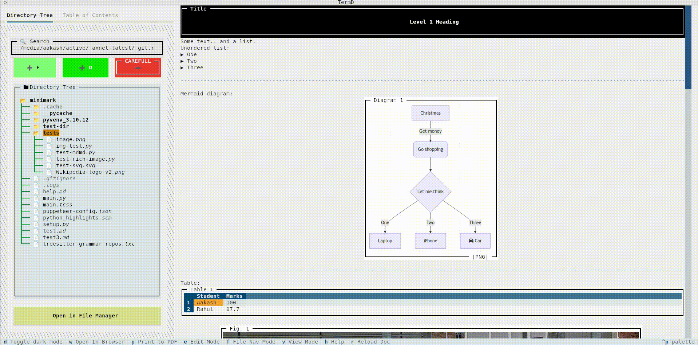
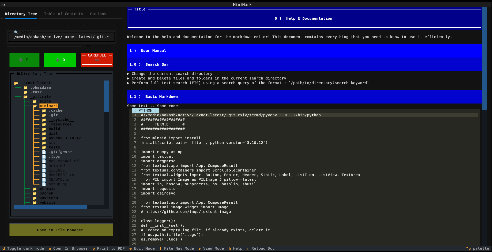
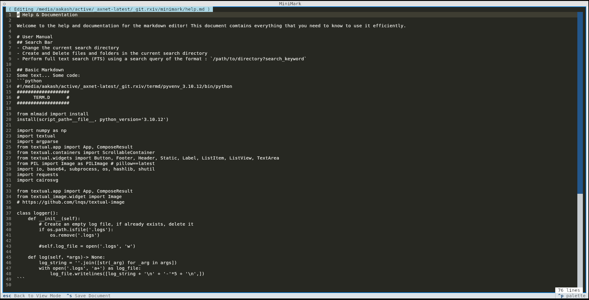

# 🌟 MiniMark 🌟 : The CLI Markdown Editor / Viewer
## The *FIRST* Command-line markdown editor which can display *IMAGES*! 🖼️📸

   

<p align="center">
  
</p>





## 🔷 Installation of Pre-requisites
1. Install [NVM Package Manager](https://github.com/nvm-sh/nvm) : 
  ```bash
  curl -o- https://raw.githubusercontent.com/nvm-sh/nvm/v0.40.1/install.sh | bash
  ```
2. Install [Pupetteer](https://pptr.dev) : 
  ```bash
  npx puppeteer browsers install chrome-headless-shell
  ```
3. Install [Mermaid CLI](https://github.com/mermaid-js/mermaid-cli) : 
  ```bash
  npm install -g @mermaid-js/mermaid-cli
  ```
4. Install [Ripgrep](https://github.com/BurntSushi/ripgrep) Utility :
  ```bash
  sudo apt install ripgrep
  ```
5. Install [Kitty](https://sw.kovidgoyal.net/kitty/) :
  ```bash
  sudo apt install kitty
  ```
## 🔷 Installation & Usage
- For Ubuntu < 24.04 LTS : `pip3 install minimark`
- For Ubuntu == 24.04 LTS : `pip3 install minimark --break-system-packages` (NOTE : Ubuntu 24 does not allow installing any python packages without the additional flag, but rest assured : IT IS SAFE, if you dont want this, you can install Minimark in a separate Python venv)

### **Usage**
To open a markdown file with minimark, simply... 
1. Open the Kitty terminal emulator.
2. Within Kitty, use the command : `minimark -file /location/to/my_markdown_file.md`

## 🔷 Features
(🟢 = Impemented, 🔵 = May work, but hasn't been tested, 🟠 = Upcoming)
- Dark mode support 🟢
- ⭐ Latex support 🟢
- ⭐ Mermaid Diagram Support 🟢
- Windows Support 🔵 ([#19](https://github.com/xbais/minimark/issues/19))
- TODO support 🟠
- Git versioning support 🟠
- Export to other formats (PDF / Word / HTML / Latex) 🟠
- Rich Email support 🟠
- Online File Sync 🟠
- Online collaboration 🟠
- SSH support (can work over SSH) 🔵
- Support for emoji short-codes 🟢
- Zotero support 🟠
- TTS support 🟢 (Basic [#16](https://github.com/xbais/minimark/issues/16))
- Hand-drawing support 🟠 (Excalidraw)
- 🌟 ChatGPT and Generative AI integration

## 🔷 Links
- Official Webpage & Documentation : https://xbais.net/minimark.html
- PyPI : https://pypi.org/project/minimark/0.0.1.2/#description
