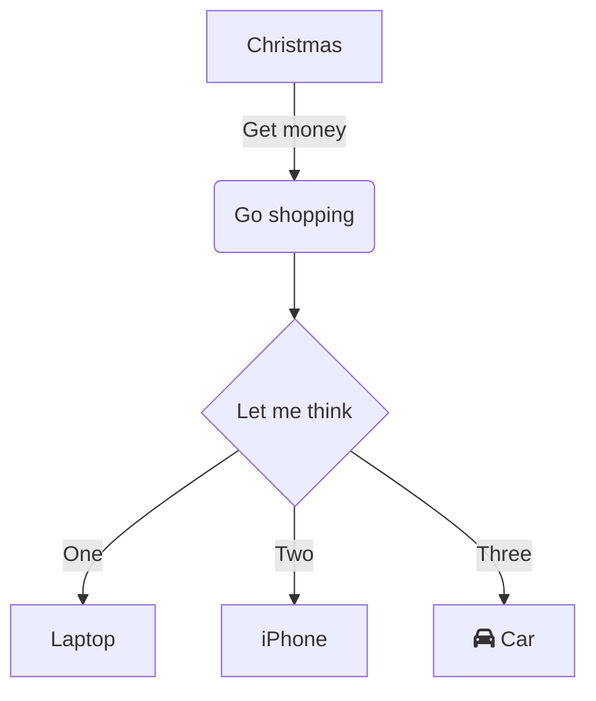
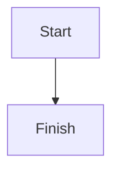

# Level 1 Heading
# This Shouls Act As Heading?
Some text.. and a list:
Unordered list:
- ONe
- Two
- Three

---

Mermaid diagram:


---

Table:
|Student|Marks|
|---|---|
|Aakash|100|
|Rahul|97.7|


## Level 2 Heading : Testing Code Block
Some text... Some code:
```python
#!/media/aakash/active/_axnet-latest/_git.rxiv/termd/pyvenv_3.10.12/bin/python
###################
#     TERM.D      #
###################

from mlmaid import install
install(script_path=__file__, python_version='3.10.12')

import numpy as np 
import textual
import argparse
from textual.app import App, ComposeResult
from textual.containers import ScrollableContainer
from textual.widgets import Button, Footer, Header, Static, Label, ListItem, ListView, TextArea
from PIL import Image as PILImage # pillow==latest
import io, base64, subprocess, os, hashlib, shutil
import requests
import cairosvg

from textual.app import App, ComposeResult
from textual_image.widget import Image
# https://github.com/lnqs/textual-image

class logger():
    def __init__(self):
        # Create an empty log file, if already exists, delete it
        if os.path.isfile('.logs'):
            os.remove('.logs')
        
        #self.log_file = open('.logs', 'w')
    
    def log(self, *args)-> None:
        log_string = ''.join([str(_arg) for _arg in args]) 
        with open('.logs', 'a+') as log_file:    
            log_file.writelines([log_string + '\n' + '-'*5 + '\n',])
```

### Level 3 Heading : Testing Latex and Mermaid Rendering
Testing Block Latex:
$$
\int x dx
$$

Testing Inline Latex : $\int x dx$

Testing mermaid diagrams:


#### Level 4 Heading (Testing Inline Markdown) : ==Highlight== **Bold** *Italics* ~~Strike~~ `Code` __underline__
Testing inline MD in unordered list:
- ==Highlight==
- **Bold**
- *Italics*
- __underline__
- `inline code`
- ~~strike through~~

Testing inline MD in ordered list:
1. ==Highlight==
1. **Bold**
1. *Italics*
1. __underline__
1. `inline code`
1. ~~strike through~~

Testing inline markdown within a paragraph:
==Highlight== **Bold** *Italics* __underline__ `inline code` ~~strike through~~

Testing markdown within block quote:
> This is a block quote.
> Does markdown work within it ? ==Highlight== **Bold** *Italics* `code` ~~strike~~ __underline__
> Does it work?

##### Level 5 Heading
Some text

###### Level 6 Heading
Some text


