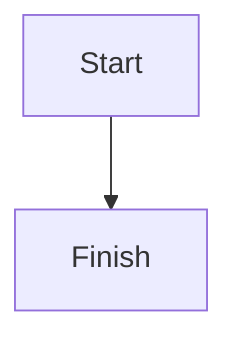
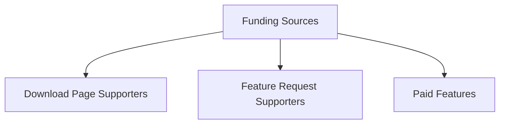

# Help & Documentation

Welcome to the help and documentation for the markdown editor! This document comtains everything that you need to know to use it efficiently.

# User Manual
## Search Bar
- Change the current search directory
- Create and Delete files and folders in the current search directory
- Perform full text search (FTS) using a search query of the format : `/path/to/directory?search_keyword`

## Basic Markdown
Some text... Some code:
```python
#!/media/aakash/active/_axnet-latest/_git.rxiv/termd/pyvenv_3.10.12/bin/python
###################
#     TERM.D      #
###################

from mlmaid import install
install(script_path=__file__, python_version='3.10.12')

import numpy as np 
import textual
import argparse
from textual.app import App, ComposeResult
from textual.containers import ScrollableContainer
from textual.widgets import Button, Footer, Header, Static, Label, ListItem, ListView, TextArea
from PIL import Image as PILImage # pillow==latest
import io, base64, subprocess, os, hashlib, shutil
import requests
import cairosvg

from textual.app import App, ComposeResult
from textual_image.widget import Image
# https://github.com/lnqs/textual-image

class logger():
    def __init__(self):
        # Create an empty log file, if already exists, delete it
        if os.path.isfile('.logs'):
            os.remove('.logs')
        
        #self.log_file = open('.logs', 'w')
    
    def log(self, *args)-> None:
        log_string = ''.join([str(_arg) for _arg in args]) 
        with open('.logs', 'a+') as log_file:    
            log_file.writelines([log_string + '\n' + '-'*5 + '\n',])
```

### Level 3 Heading : Testing Latex and Mermaid Rendering
Testing Block Latex:
$$
\int x dx
$$

Testing Inline Latex : $\int x dx$

Testing mermaid diagrams:


#### Level 4 Heading
Some text

##### Level 5 Heading
Some text

###### Level 6 Heading
Some text


# Insider's Developer Manual
## Funding

1. Put the application on your personal website with support button using which users can donate you. Also add a list of supporters on the same page to motivate more people to support.
1. Also add a support / feature request / report bug button within the app that will directly lodge a feature request, if people want they can donate along with the feature request for a faster redressal.
1. You can add some niche paid features.
## Search Bar